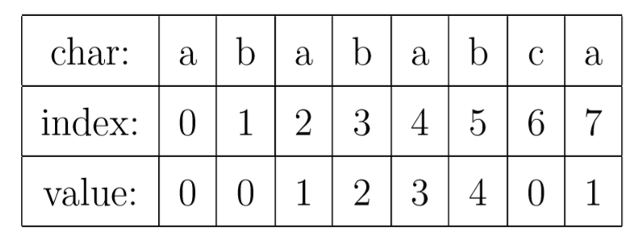

## 经典算法

### KMP

28-实现 strStr()


#### KMP算法
主要是要计算前缀部分匹配表(Partial Match Table)的数组， 也称为next数组；  
表示在s[i：j]子串中，前缀与后缀完全匹配的最大长度


#### 题目
##### 28-实现 strStr()

> 实现 strStr() 函数。
> 给你两个字符串 haystack 和 needle ，请你在 haystack 字符串中找出 needle 字符串出现的第一个位置（下标从 0 开始）。如
> 果不存在，则返回 -1 。
> 说明：
> 当 needle 是空字符串时，我们应当返回什么值呢？这是一个在面试中很好的问题。
> 对于本题而言，当 needle 是空字符串时我们应当返回 0 。这与 C 语言的 strstr() 以及 Java 的 indexOf() 定义相符。

> 示例 1：
> 输入：haystack = "hello", needle = "ll"
> 输出：2

```python
class Solution:
    def strStr(self, haystack: str, needle: str) -> int:
        a = len(needle)
        b = len(haystack)
        if a == 0:
            return 0
        next = self.getnext(a, needle)
        p = -1
        for j in range(b):
            while p >= 0 and needle[p + 1] != haystack[j]:
                p = next[p]
            if needle[p + 1] == haystack[j]:
                p += 1
            if p == a - 1:
                return j - a + 1
        return -1

    def getnext(self, a, needle):
        next = ['' for i in range(a)]
        k = -1
        next[0] = k
        for i in range(1, len(needle)):
            while (k > -1 and needle[k + 1] != needle[i]):
                k = next[k]
            if needle[k + 1] == needle[i]:
                k += 1
            next[i] = k
        return next

```